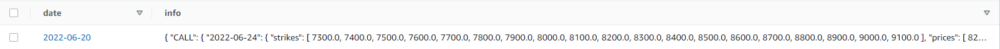

<h1>Cloud Dash practice</h1>

## Installation

There are only two prerequisites:

* [Docker](https://docs.docker.com/get-docker/)
* [Docker-compose](https://docs.docker.com/compose/install/)

Having both, you'll need to clone the repository:

``` bash
git clone https://github.com/chalangui/practica_cloud_dash
```

## Usage

You'll need to run the docker containers:

``` bash
docker build -t dash .
```
We test if the containers are active
``` bash
docker run -p 8080:8080 dash
```
## Environment

Now you have access to:
* Dashboard: http://127.0.0.1:8080/
<!---
 (* Dashboard Cloud Run url: https://practica-cloud-dash-t3gv4buioa-uc.a.run.app/ (May take a while, as it is serverless))
-->
## Creation process:

The following services have been used in this practice:
- Cloud run by Google
- Lambda AWS 
- DynamoDB AWS

Every day we run a lambda at 22:00, with which through webscrapping we obtain the data that we send to dynamoDB.

DynamoDB:



Sample data:
https://pastebin.pl/view/53dde1a6

In the dashboard made with dash we get the data from dynamoDB with boto3, where we process it for the different tabs.

The dash components used are those of boostrap:
* Boostrap Documentation: https://dash-bootstrap-components.opensource.faculty.ai/


##### Made by Adrian Pascual and Sergio Boal
